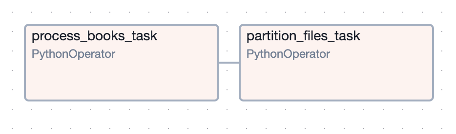
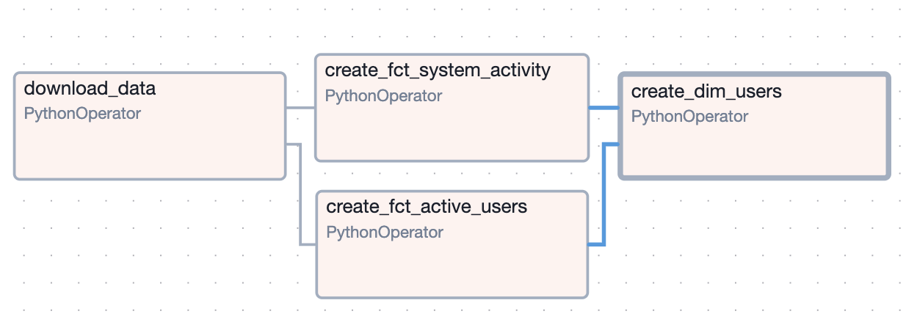

# bitso_test

---

### Table of Contents

- [bitso_test](#bitso_test)
- [Challenge 1](#challenge-1)
  - [Challenge Description](#challenge-description)
  - [Solution Description](#solution-description)
    - [Partition Keys](#partition-keys)
  - [Files](#files)
    - [Code](#code)
    - [Others](#others)
- [Challenge 2](#challenge-2)
  - [Challenge Description](#challenge-description-1)
  - [Solution Description](#solution-description-1)
    - [Star Schema](#star-schema)
    - [Daily Incremental Load](#daily-incremental-load)
    - [Merge Strategy](#merge-strategy)
    - [Advantages](#advantages)
    - [Downsides](#downsides)
  - [Files](#files-1)
    - [Code](#code-1)
    - [Others](#others-1)
  - [Solution Data Model (ERD)](#solution-data-model-erd)
  - [Questions to be solved by queries](#questions-to-be-solved-by-queries)

---

# Challenge 1

## Challenge Description

“Markets team” needs to monitor the bid-ask spread from the “order books” MXN_BTC and USD_MXN, they need to do custom analysis on the bid-ask spread and create alerts whenever the spread is bigger than 1.0%, 0.5%, 0.1% or any other custom value in one second observations.

To enable them you need to create a process that gets the order books each second and extract the necessary values to power the analysis. The process should store a file every 10 min with all the observations gathered (600 records) in that timespan. This file will be stored in the “data lake” and must be partitioned (You’ll define the relevant partitions).

## Solution Description

Our solution for integrating Bitso API data into our simulated datalake involves two key processes orchestrated through Apache Airflow. First, we implemented a real-time data collection task that fetches data from the Bitso API every second and stores it as JSON files in a sandbox directory. Second, a periodic ETL task to aggregate and transform these JSON files into structured Parquet or CSV files. These files are organized in a partitioned directory structure based on the book and date, optimizing data storage and query efficiency.

### Partition Keys

Choosing book and date as partitions has several advantages, here are some:

- After checking the case of use (alarms), most of the analysis will require to execute queries using just a single book. Grouping by book makes it easy to query and analyze data for specific books.
- Grouping by date allows efficient time-based queries and analyses. This is especially useful for time-series data, as it enables quick access to historical data for a particular day or range of days.
- Organizing data by book and date makes it easier to manage and maintain. You can easily archive or delete old data based on date partitions, and updates to specific books can be isolated.
- By partitioning data in S3 (book and date), Redshift Spectrum can efficiently prune partitions that are not relevant to a query, reducing the amount of data scanned and improving query performance.




## Files

### Code

- dags/dag_challenge1.py: DAG for Airflow
- src/challenge1.py: Functions executed for challenge 1
- src/bitshoauth: Class used to create auth for Bitso API
- src/utils.py: Functions of common use
- src/config.py: Configuration values

### Others
- **sandbox/:** Directory where JSON data is stored temporaly until is moved to datalake
- **s3-partitioned/:** Directory partitioned by book and date where all records retrieved from Bitso API.

---

# Challenge 2

## Challenge Description
In this [URL](https://github.com/IMARVI/sr_de_challenge) you’ll find 4 csv’s, each csv is a snapshot of the tables deposit, withdrawal, event and user with historic information. As a data engineer you need to provide master data for our downstream users Business Intelligence, Machine Learning, Experimentation and Marketing. These teams will use the data for multiple purposes, the tables and data model you’ll create should help them answer questions like the following:

- How many users were active on a given day (they made a deposit or withdrawal)
- Identify users haven't made a deposit
- Identify on a given day which users have made more than 5 deposits historically
- When was the last time a user made a login
- How many times a user has made a login between two dates
- Number of unique currencies deposited on a given day
- Number of unique currencies withdrew on a given day
- Total amount deposited of a given currency on a given day

## Solution Description

The approach taken to solve this challenge was to model a Star Schema datawarehouse with an incremental load data engineering strategy. Here are some of the component of the solution:

### Star Schema
Our data model comprises a central fact table surrounded by multiple dimension tables. This schema type optimizes query performance by minimizing joins and providing clear relationships between data elements.

### Daily Incremental 
Load Our data pipeline executes daily to perform an incremental load of data. This approach updates our fact table with new records while merging them with existing data stored in our data warehouse. This incremental approach ensures that our analytics reflect the latest information without reloading all data from scratch, thus optimizing processing time and resource usage.

### Merge Strategy 
During each daily run, our pipeline identifies new records from the source system and merges them into the fact table. This merge operation consolidates newly arrived data with historical records, maintaining a comprehensive dataset for analysis.

### Advantages

- The Star Schema’s structure is straightforward and easy to understand. This simplicity helps BI analysts quickly grasp the relationships between different data elements without needing in-depth knowledge of the underlying database design.
- The structure is optimized for read-heavy operations typical in BI tasks. Queries can be executed more efficiently, leading to faster retrieval times and more responsive dashboards and reports.
- The Star Schema minimizes data duplication, which helps avoid conflicting data entries and discrepancies. This ensures that ML algorithms are trained on unique, high-quality data, improving the model's building process performance.

### Downsides

- Extract, Transform, Load (ETL) processes can become complex when populating fact and dimension tables. Ensuring data consistency and integrity during the ETL process can be challenging and resource-intensive. In our case, the user dimension calculates some fields based on data that comes from our two fact tables.
- The Star Schema is often optimized for batch processing and may not be suitable for real-time data ingestion and analysis. Real-time updates to fact and dimension tables can be challenging to implement and maintain.



## Files

### Code

- **dags/dag_challenge2.py:** DAG to create scheduled pipeline in Airflow.
- **src/challenge2.py:** Functions used for challenge 2.
- **src/utils.py:** Functions of common use.
- **src/config.py:** Configuration values.

### Others

- **input/:** Directory where the process downloads the files.
- **zip/:** Directory where the output files (facts and dimensios) from process are stored.
- **documentation/data_model_erd.png:** ERD image for data model.

## Solution Data Model (ERD)


## Questions to be solved by queries

1. **How many users were active on a given day (they made a deposit or a withdrawal)**

    ```sql
    SELECT COUNT(DISTINCT user_id)
    FROM fct_active_users
    WHERE DATE(event_tstamp) = '2024-01-01' -- As example
    ```

2. **Identify users haven't made a deposit**

    ```sql
    SELECT COUNT(DISTINCT user_id)
    FROM dim_users
    WHERE first_deposit_tstamp IS NULL
    ```

3. **Identify on a given day which users have made more than 5 deposits historically**

    ```sql
    SELECT user_id
    FROM fct_system_activity
    WHERE event_type = 'DEPOSIT'
    AND event_tstamp <= '2024-01-01' -- As example
    GROUP BY user_id
    HAVING COUNT(event_id) > 5;
    ```

4. **When was the last time a user made a login**

    ```sql
    SELECT user_id, last_login_tstamp
    FROM dim_users
    WHERE user_id = '7b4c1f1b8d265b23fe6013bc9e739f1b'; -- As example
    ```

5. **How many times a user has made a login between two dates**
    
    ```sql
    SELECT user_id, COUNT(DISTINCT event_tstamp)
    FROM fct_system_activity
    WHERE event_type = 'LOGIN'
    AND user_id = '7b4c1f1b8d265b23fe6013bc9e739f1b'; -- As example
    AND DATE event_tstamp BETWEEN '2024-01-01' AND '2024-02-01' -- As example
    GROUP BY 1
    ```